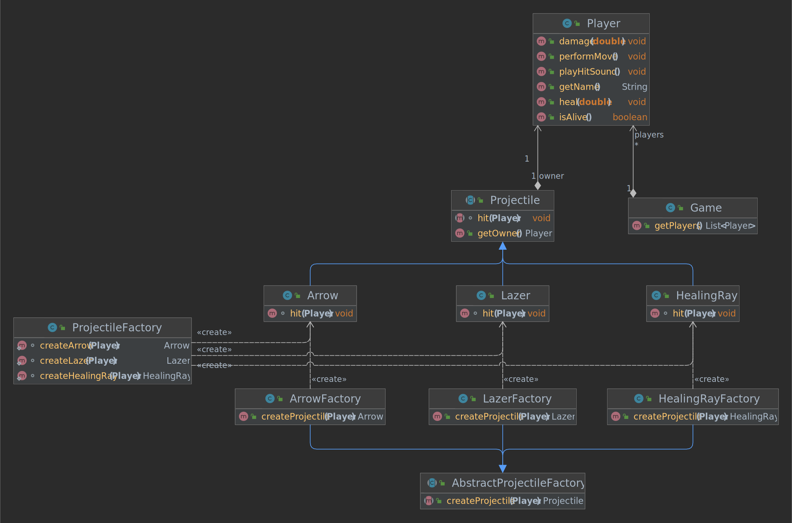

# Factory Pattern

This example covers common ways of implementing a factory:

- [AbstractProjectileFactory](./AbstractProjectileFactory.java)
  - [ArrowFactory](./ArrowFactory.java)
  - etc.
- [ProjectileFactory](./ProjectileFactory.java)
  - `createArrow(...)`
  - etc.

## (Abstract) Factory Pattern

As seen in this example.

**Type**: Creational\
**Purpose**: Provide an interface for creating families of related or dependent objects without specifying their concrete classes.\
**Participants**: (Abstract and concrete) creators and products

**Pros**
- The client/user is isolated from concrete (product and factory) classes

**Cons**
- Difficult to add new product families as changes are necessary in all concrete factories

## Factory Method Pattern

If the game had different ranged items, each `RangedItem` could have a `createProjectile` method returning a `Projectile`.

**Type**: Creational\
**Purpose**: Delegate the instantiation logic to child classes.\
**Participants**: (Abstract and concrete) creators and products

**Pros**
- Factory method decouples itself from the concrete product classes
- Constructors can be changed and only the subclass using it has to be adapted
- The factory method can have a more meaningful name than the constructor of a product class itself

**Cons**
- Possible that code complexity increases due to more classes that are needed