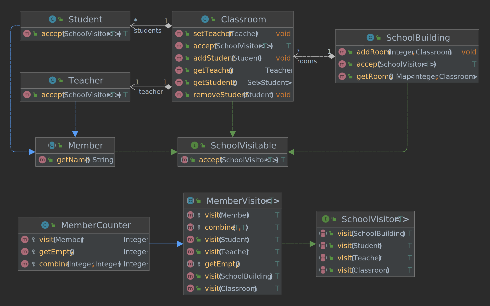

# School Model

This example utilizes several design patterns.

## Visitor Pattern

- [SchoolVisitable](./SchoolVisitable.java)
- [SchoolVisitor](./SchoolVisitor.java)

**Type**: Behavioral\
**Purpose**: Represent an operation to be performed on the elements of
an object structure.\
**Participants**: Data structures, visitors

**Pros**
- New operations can be easily added => new visitor
- Functionality of one operation is at one place and not scattered in the classes of the data structure
- No need to brute-force check the type of object at runtime

**Cons**
- Not ideal to add new operators => Implement many visit methods and change all visitors

## Template Pattern

- [MemberVisitor](./MemberVisitor.java)

**Type**: Behavioral\
**Purpose**: Define an algorithm with rigid steps; delegate the execution
of the steps to subclasses.\
**Participants**: Template class, subclasses